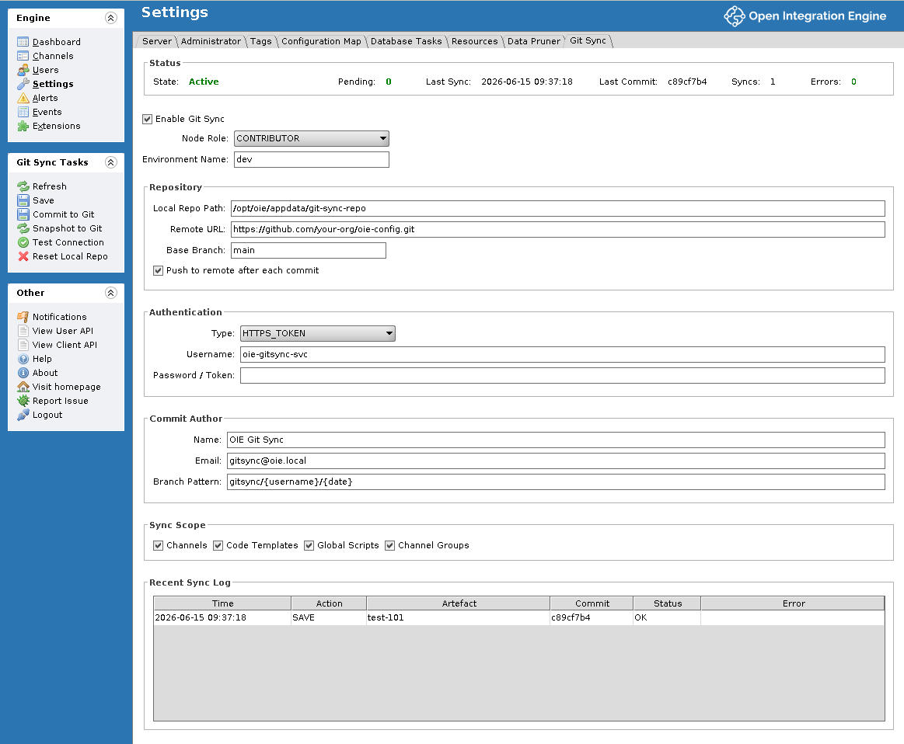

# oie-git-sync

[](https://github.com/enricogasparini/oie-git-sync/actions/workflows/ci.yml)
[](https://github.com/enricogasparini/oie-git-sync/actions/workflows/codeql.yml)
[](https://github.com/enricogasparini/oie-git-sync/blob/main/.github/workflows/ci.yml)
[](https://github.com/enricogasparini/oie-git-sync/releases)
[](LICENSE)
[](https://adoptium.net/)
[](https://github.com/openintegrationengine/engine)

A server extension for the [Open Integration Engine](https://github.com/openintegrationengine/engine) (OIE) that provides bidirectional Git synchronisation for channel configurations. Enables proper CI/CD workflows for healthcare integration channels: version control, code review, linting, secrets scanning, and automated promotion across environments.

## Project Status

This plugin is written and maintained by a **sole developer**. It is published primarily for **forking**: take it, adapt it to your environment, and maintain your own copy — the [MPL-2.0 licence](LICENSE) is chosen for exactly that.

What this means in practice:

- There is no support commitment, no public issue tracker, and unsolicited pull requests are not accepted (see [CONTRIBUTING.md](CONTRIBUTING.md)).
- If you need a change, fork the repository and make it. You do not need permission.
- The software is provided as-is, without warranty. Test thoroughly in your own environment before any production use — particularly in healthcare settings.

## Features

### Direction A: OIE to Git (batch commit, user-driven)
- Channel and code template library save/remove events are tracked per-user as **pending changes** (no immediate commit)
- The user clicks **Commit to Git** in the admin console settings panel when ready, and all their pending changes go into one clean commit on a per-user feature branch
- Default branch pattern: `gitsync/{username}/{date}` (configurable; tokens: `{username}`, `{date}`, `{environment}`, `{branch}`)
- Pushes to a configured remote (GitHub, Azure DevOps, GitLab, Bitbucket)
- Full sync exports all artefacts (channels, code templates, global scripts, channel groups, config map template) to a dedicated `gitsync/fullsync/{date}` branch

### Direction B: Git to OIE (pipeline-driven)
- REST API endpoint for CI/CD pipelines to promote approved configurations from Git to a target OIE environment
- Diff-based change detection: only promotes artefacts changed since last promotion
- Imports **all artefact types** from Git, not just channels:
  - Channels (via `ChannelController.updateChannel`) — the target's channel metadata (enabled state, pruning settings) and tags are preserved, so promoting a channel does not re-enable one deliberately disabled on the target
  - Code template libraries (via `CodeTemplateController.updateLibrariesAndTemplates`) — merged with the target's unchanged libraries, so a partial promotion never deletes them
  - Channel groups (via `ChannelController.updateChannelGroups`) — merged the same way
  - Global scripts (via `ScriptController.setGlobalScripts`)
  - Configuration map (merged: new keys added with empty values and the template's comments, existing values never overwritten)
- Preview-then-apply UX in the admin console (always previews before applying)
- Optional auto-deploy checkbox after promotion
- SyncGuard prevents circular commits during promotion
- Optional shared-secret header (`X-GitSync-API-Key`) on the promotion endpoints as defence-in-depth on top of OIE RBAC (`apiKey` setting, encrypted at rest)
- **Restore from Main** recovery path: imports everything from the base branch ignoring `lastPromotedCommit` (for rebuilding a wiped dev instance)

### Node Roles
The plugin distinguishes between contributor and receiver nodes via a `nodeRole` setting:
- **CONTRIBUTOR**: users edit channels here, changes tracked as pending, user clicks Commit to Git
- **RECEIVER**: receives changes from Git via Import, local edits are ignored
- **BOTH** (default): full functionality, suitable for single-instance or recovery

The settings panel shows role-appropriate task buttons only. Save/remove hooks are disabled on RECEIVER nodes.

**Prod drift detection**: when the `driftBranchPattern` setting is configured (e.g. `prod-drift/{date}`), Commit to Git routes changes to that drift branch instead of the user's feature branch. Useful for auditing manual edits made directly on a production node. Empty (the default) disables it.

### Admin Console Integration



*The Git Sync settings tab on a contributor node. The Password / Token field is intentionally blank — the stored credential is encrypted at rest and never returned to the console, so blank means "keep the existing token".*

- Settings panel in the OIE admin console (Settings > Git Sync)
- Status bar showing sync state, **pending change count**, last commit, error count, environment name, node role
- Configurable feature branch pattern (tokens: `{username}`, `{date}`, `{environment}`, `{branch}`)
- Sync log table showing recent operations
- Role-filtered task buttons:
  - **Contributor**: Commit to Git (with Discard All in dialog), Snapshot to Git
  - **Receiver**: Import from Git (preview-then-apply), Restore from Main
  - **Both**: Test Connection, Reset Local Repo
- Per-artefact sync toggles
- Commit author is resolved from the OIE user's firstName/lastName/email (falls back to configured values if lookup fails)

## Installation

### Prerequisites
- OIE 4.5.2+
- Java 17+

### Install
1. Download the latest `gitsync-<version>.zip` from the [Releases](https://github.com/enricogasparini/oie-git-sync/releases) page
2. Extract the `gitsync/` directory into your OIE `extensions/` directory
3. Restart OIE
4. Configure via Settings > Git Sync in the admin console

### Build from Source
```bash
# Clone the repo
git clone https://github.com/enricogasparini/oie-git-sync.git
cd oie-git-sync

# Ensure the OIE engine source is at ../engine (or set engine.dir in build.properties)
# The engine must be built first:
cd ../engine/server && ant -f mirth-build.xml -DdisableSigning=true -DdisableTests=true
cd ../../oie-git-sync

# Fetch dependencies and build
ant fetch-libs
ant build

# Output: dist/gitsync-<version>.zip
```

## Configuration

### Dev Environment (Direction A - push to Git)

In the admin console, go to Settings > Git Sync:

| Setting | Value |
|---|---|
| Enable Git Sync | Ticked |
| Node Role | `CONTRIBUTOR` |
| Environment Name | `dev` |
| Local Repo Path | `/opt/oie/appdata/git-sync-repo` (or leave as default) |
| Remote URL | `https://github.com/your-org/oie-channels.git` |
| Base Branch | `main` |
| Commit Branch Pattern | `gitsync/{username}/{date}` |
| Push to remote | Ticked |
| Authentication Type | `HTTPS_TOKEN` |
| Username | Your Git username |
| Password / Token | Personal access token with repo permissions |

### Prod Environment (Direction B - receive from Git)

Same repo/auth settings but:

| Setting | Value |
|---|---|
| Node Role | `RECEIVER` |
| Environment Name | `prod` |
| Push to remote | **Unticked** (prod should not push back to Git) |

All other settings (remote URL, base branch, credentials) should match dev so that prod can fetch the same repo.

## Git Repository Layout

The plugin creates this structure in the configured Git repository:

```
channels/
  {channel-id}/
    channel.xml              # Full channel XML (without environment-specific exportData)
    channel-metadata.json    # Human-readable: id, name, revision, description

code-templates/
  {library-id}/
    library.xml              # Library metadata (channel ID refs, no template bodies)
    {template-id}.xml        # Individual code template

global-scripts/
  deploy.js                  # Global deploy script
  undeploy.js                # Global undeploy script
  preprocessor.js            # Global preprocessor script
  postprocessor.js           # Global postprocessor script

channel-groups/
  {group-id}.xml             # Channel group (with channel ID refs only)

config-map/
  config-map-template.json   # Keys and comments only (values deliberately excluded)
```

### Design Decisions
- **Channel ID as folder name**: IDs are immutable UUIDs. Channel names can change without creating Git rename noise. `channel-metadata.json` provides human readability.
- **Individual code template files**: Enables meaningful Git diffs when reviewing changes.
- **Global scripts as .js files**: Enables syntax highlighting in Git UIs and linting in CI pipelines.
- **Config map values excluded**: The configuration map typically contains connection strings and credentials. Only keys and comments are committed. Actual values are set per environment.

## CI/CD Pipeline Integration

### Typical Workflow

```
Developer makes one or more channel edits in Dev OIE
    |
    v
Each save is recorded as a pending change in the developer's queue
    |
    v
Developer clicks "Commit to Git" in the admin console
    |
    v
Plugin commits all pending changes as one commit on a feature branch
(default pattern: gitsync/{username}/{date}) and pushes to remote
    |
    v
Developer opens Pull Request from the feature branch to main
    |
    v
CI pipeline runs: XML validation, secrets scanning, linting
    |
    v
Reviewer approves and merges PR
    |
    v
Post-merge pipeline calls /promote on Prod OIE
    |
    v
Prod OIE fetches from Git, imports changed channels
```

### Pipeline Promotion Call

```bash
curl -X POST https://prod-oie:8443/api/extensions/gitsync/promote \
  -u cicd-user:password \
  -H "X-Requested-With: XMLHttpRequest" \
  -H "Content-Type: application/xml" \
  -d '<promotionRequest>
    <deploy>true</deploy>
    <overwrite>true</overwrite>
  </promotionRequest>'
```

If the `apiKey` setting is configured on the target node, also pass the shared
secret: `-H "X-GitSync-API-Key: $GITSYNC_API_KEY"`. Fully qualified element
names (`<com.mirth.connect.plugins.gitsync.model.PromotionRequest>`) are also
accepted.

### Request Parameters

| Parameter | Type | Default | Description |
|---|---|---|---|
| `commitHash` | string | HEAD | Specific commit to promote from. Defaults to latest. The working tree is reset to this commit, so the imported content matches the pin exactly. |
| `deploy` | boolean | false | Whether to deploy channels after import. |
| `overwrite` | boolean | true | Whether to overwrite channels modified locally on the target. With `false`, skipped channels are reported as errors and excluded from deployment. |
| `channelIds` | set | null | Specific channel IDs to promote. Null means all changed channels. Applies to channels only — changed libraries, groups, global scripts, and the config map are still imported in full. |
| `dryRun` | boolean | false | Preview only, don't apply changes. |
| `fresh` | boolean | false | Recovery mode: ignore `lastPromotedCommit` and import everything from the target commit. Used by **Restore from Main**. |

`lastPromotedCommit` only advances when every artefact imports cleanly. A promotion that reports errors leaves it unchanged, so the failed artefacts are retried on the next run; fix the cause and re-promote.

### Response

```xml
<promotionResult>
  <success>true</success>
  <commitHash>abc123...</commitHash>
  <channelsImported>2</channelsImported>
  <channelsDeployed>2</channelsDeployed>
  <records>
    <syncRecord>
      <artifactName>ADT Inbound</artifactName>
      <action>PROMOTE</action>
      <success>true</success>
    </syncRecord>
  </records>
  <errors/>
  <warnings/>
</promotionResult>
```

### Preview Before Promoting

```bash
curl -X POST https://prod-oie:8443/api/extensions/gitsync/promote/preview \
  -u cicd-user:password \
  -H "X-Requested-With: XMLHttpRequest" \
  -H "Content-Type: application/xml" \
  -d '<promotionRequest>
    <overwrite>true</overwrite>
  </promotionRequest>'
```

### Example: GitHub Actions Pipeline

```yaml
name: Promote to Prod

on:
  push:
    branches: [main]

jobs:
  promote:
    runs-on: ubuntu-latest
    steps:
      - name: Promote channels to Prod
        run: |
          RESULT=$(curl -sf -X POST https://prod-oie.example.com:8443/api/extensions/gitsync/promote \
            -u "${{ secrets.OIE_PROD_USER }}:${{ secrets.OIE_PROD_PASSWORD }}" \
            -H "X-Requested-With: XMLHttpRequest" \
            -H "X-GitSync-API-Key: ${{ secrets.GITSYNC_API_KEY }}" \
            -H "Content-Type: application/xml" \
            -d '<promotionRequest>
              <deploy>true</deploy>
              <overwrite>true</overwrite>
            </promotionRequest>')
          echo "$RESULT"
          echo "$RESULT" | grep -q "<success>true</success>" || exit 1
```

### Example: Azure DevOps Pipeline

```yaml
trigger:
  branches:
    include:
      - main

pool:
  vmImage: 'ubuntu-latest'

steps:
  - task: Bash@3
    displayName: 'Promote channels to Prod'
    inputs:
      targetType: 'inline'
      script: |
        RESULT=$(curl -sf -X POST https://prod-oie.example.com:8443/api/extensions/gitsync/promote \
          -u "$(OIE_PROD_USER):$(OIE_PROD_PASSWORD)" \
          -H "X-Requested-With: XMLHttpRequest" \
          -H "X-GitSync-API-Key: $(GITSYNC_API_KEY)" \
          -H "Content-Type: application/xml" \
          -d '<promotionRequest>
            <deploy>true</deploy>
            <overwrite>true</overwrite>
          </promotionRequest>')
        echo "$RESULT"
        echo "$RESULT" | grep -q "<success>true</success>" || exit 1
```

## REST API Reference

All endpoints are under `/api/extensions/gitsync/` and require OIE authentication.

| Method | Path | Permission | Description |
|---|---|---|---|
| GET | `/status` | View Status | Sync status including node role, pending count, last commit, error count |
| GET | `/pending?username=X` | View Status | Pending changes for the specified user (current user if omitted) |
| POST | `/pending/commit?username=X&message=Y` | Manage Settings | Commits pending changes for the user to their feature branch |
| POST | `/pending/discard?username=X` | Manage Settings | Discards pending changes for the user |
| POST | `/_sync` | Manage Settings | Snapshot: full export of all artefacts to a `gitsync/fullsync/{date}` branch |
| GET | `/log?limit=50` | View Status | Recent sync log entries |
| POST | `/_testConnection` | Manage Settings | Test remote Git connectivity |
| POST | `/_resetLocalRepo` | Manage Settings | Delete the local clone and re-clone from the remote (recovery) |
| POST | `/promote` | Promote | Import all artefact types from Git (channels, code templates, groups, scripts, config map merge) |
| POST | `/promote/preview` | Promote | Preview what would change without applying |

Plugin properties are managed via the standard OIE extension properties API:
- `GET /api/extensions/Git%20Sync/properties`
- `PUT /api/extensions/Git%20Sync/properties`

## Excluding Channels

Create a `.gitsync-ignore` file in the root of the local Git repo directory with one channel ID per line:

```
# Channels to exclude from sync
a1b2c3d4-5678-90ab-cdef-1234567890ab
# Comments are supported
```

## Security Considerations

- **Credentials**: Git credentials (tokens, passwords) are encrypted at rest via OIE's `Encryptor` before being persisted to the plugin properties database, and are never round-tripped back to the admin console. Use a dedicated service account with minimal permissions.
- **Promotion API key**: When the `apiKey` setting is configured (also encrypted at rest), callers of `/promote` and `/promote/preview` must present a matching `X-GitSync-API-Key` header in addition to OIE RBAC. Leave empty to disable.
- **Config map values**: Deliberately excluded from Git sync. Only keys and comments are committed. Set actual values per environment via the OIE admin console.
- **Channel XML**: May contain encrypted values (OIE encrypts sensitive connector properties). These are committed as-is since the encryption key is server-specific.
- **RBAC**: The plugin defines three permission levels: View Status, Manage Settings, and Promote. Assign pipeline service accounts the Promote permission only.

## Known Limitations

- **Global scripts, channel groups, and configuration map** do not have plugin hooks in OIE. Changes to these are only exported via **Snapshot to Git** (the `/_sync` endpoint), not tracked as pending changes on save.
- **Configuration map values** are never committed - only keys and comments (deliberate security choice). On import, new keys are merged with empty values; existing keys are never overwritten.
- **Single-node only**. OIE does not currently support clustering, but if it did, the plugin would need a designated sync primary or distributed locking.
- **Admin console multi-connection caveat**: the Mirth admin client uses a global static `PlatformUI.MIRTH_FRAME` reference. If a launcher (e.g. Ballista) runs multiple server connections in the same JVM, they may share client state - avoid having two connections open simultaneously, or use a launcher that spawns a fresh JVM per connection (e.g. OpenWebStart, direct `javaws`).

## Licence

[Mozilla Public License 2.0](LICENSE) - matching the OIE project.

## Contributing

This project is not open to external contributions and has no public issue tracker — fork it instead (see [Project Status](#project-status) above). See [CONTRIBUTING.md](CONTRIBUTING.md) for building from source, and [SECURITY.md](SECURITY.md) for how to report vulnerabilities privately.
